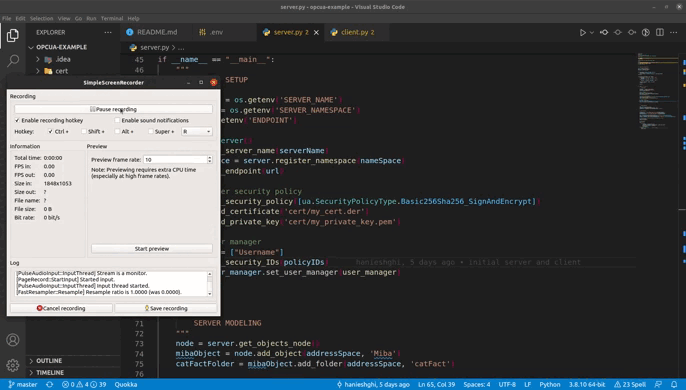

# OPCUA-example
OPCUA server and client with encryption and authentication

 ### Server key points:
    - User Authentication (username and password)
    - Security Mode and Policy: SignAndEncrypt and Basic256Sha256
    - String identifiers for the UA Nodes.
    - The UA Node Miba.heartbeat should switch between true and false every 1 second.

### Client key points:
    - Hold the Connection
    - Automatically Reconnection
    - Make a REST call every 5 seconds to get  Cat data.
    - Write that data to the corresponding UA Nodes

# How to run the code

- Enter the virtual env. For example Linux:
        `source venv/bin/activate`
- install requirements:
        `pip install -r requirements.txt`
- set env variables:
    - create a new .env file and define the variables. for more information see the example.env file.
- run server.py
        `python server.py`
- run client.py
        `python client.py`
